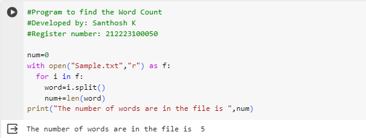

# Word-count
## AIM:
To write a python program for getting the word count from a text.
## EQUIPEMENT'S REQUIRED: 
PC
Anaconda - Python 3.7
## ALGORITHM: 
### Step 1:
Decleare number of words is 0

### Step 2: 
open it with txt file

### Step 3: 
Give range for i

### Step 4:  
Then next split the words

### Step 5: 
count the number of words

### Step 6: 
Giving print statement for getting output

## PROGRAM:
```
#Program to find the Word Count
#Developed by: Santhosh K
#Register number: 212223100050

num=0
with open("Sample.txt","r") as f:
  for i in f:
    word=i.split()
    num+=len(word)
print("The number of words are in the file is ",num)
```
### OUTPUT:


## RESULT:
Thus the program is written to find the word count from a text.
